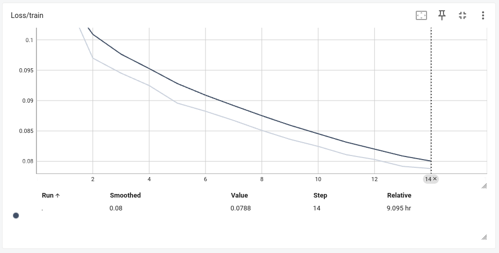
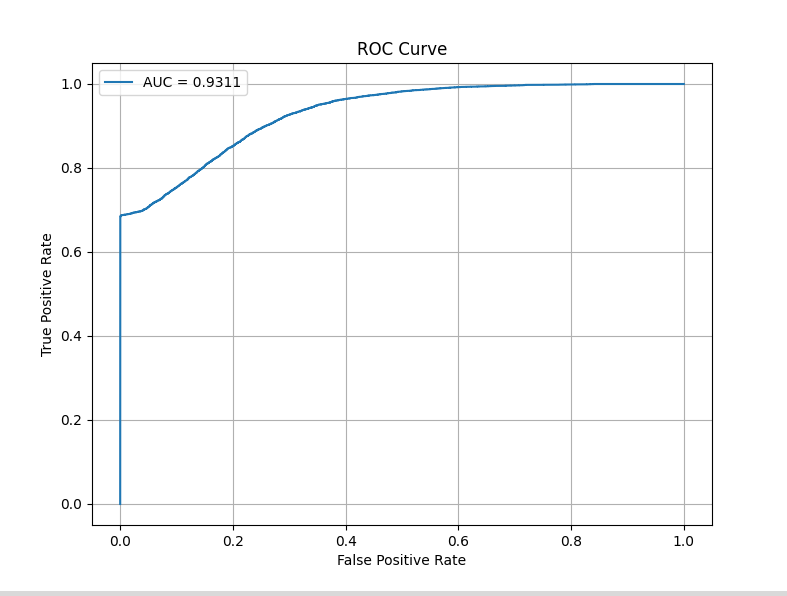
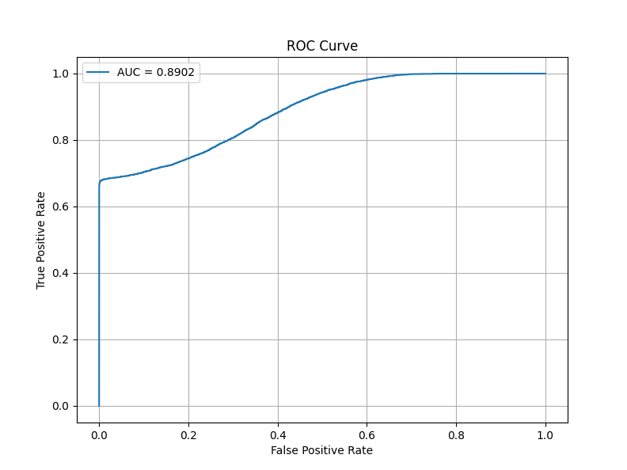
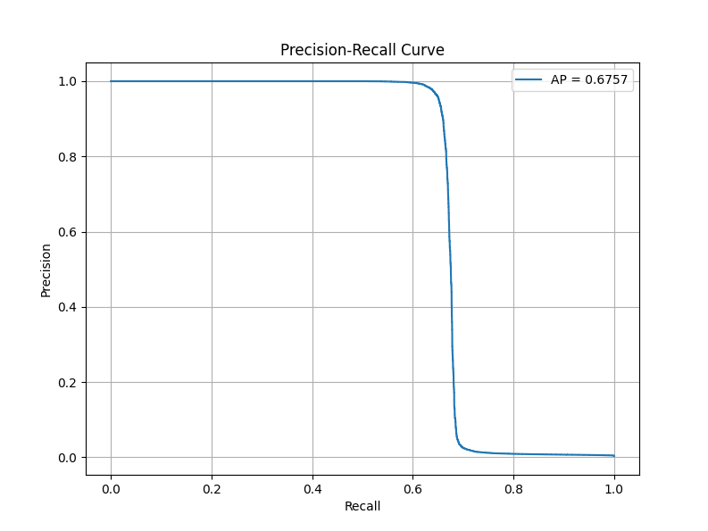

# RAdamScheduleFreeは素晴らしいぞ！


## はじめに
みなさん、[全ての学習率スケジューリングを過去にするOptimizer](https://zenn.dev/dena/articles/6f04641801b387#fnref-5928-10)という素晴らしい記事をご覧になったでしょうか？

https://zenn.dev/dena/articles/6f04641801b387#fnref-5928-10

https://github.com/facebookresearch/schedule_free/tree/main

ぜひこの素晴らしいオプティマイザを試したいと思い、顔認証用学習モデルを作成するコードを書いてみました。

かつてわたしは様々なオプティマイザ + スケジューラを試しましたが、一向に収束しないとか、Loss/trainがガッタガタ、収束するまでめっちゃ時間がかかる、などを経験してきました。

しかし**結論から言うと、RAdamScheduleFreeは素晴らしい**です。scheduleFreeバンザイ。皆さん、試すべきです。

**AdamW + CosineAnnealingLRと比べて、各エポックにかかる時間は変わらず（40min/epoch）、しかし収束までの時間が短縮されました。**

以下はAdamW + CosineAnnealingLRおよびRAdamScheduleFreeの、10エポック程度時のロスの変化です。


*AdamW + CosineAnnealingLR*


*RAdamScheduleFree*

そして、保存されたそれぞれの学習済みモデルの評価（ここではAUCスコア・ROC曲線のみ）は以下のとおりです。

**AdamW + CosineAnnealingLRが63エポック**時の学習済みモデルに対し、**RAdamScheduleFreeがたった1エポック**時の学習済みモデルであるところも注目ポイントです。


*AdamW+CosineAnnealingLR 63epoch*


*RAdamScheduleFree 1epoch*

素晴らしいと思いませんか！？

はなますなぎさ氏が書かれている「**これ使っときゃOK**」が手に入ります！


## 環境
```bash
# venv仮想環境
$ python -V
Python 3.10.12

$ pip list | grep -E 'torch|schedule'
pytorch-metric-learning  2.3.0
schedulefree             1.4
torch                    2.1.1
torchvision              0.16.1
```
```bash
$ inxi -SG --filter
System:
  Kernel: 6.8.0-49-generic x86_64 bits: 64 Desktop: Unity
    Distro: Ubuntu 22.04.5 LTS (Jammy Jellyfish)
Graphics:
  Device-1: NVIDIA TU116 [GeForce GTX 1660 Ti] driver: nvidia v: 555.42.06
  Display: x11 server: X.Org v: 1.21.1.4 driver: X: loaded: nvidia
    unloaded: fbdev,modesetting,nouveau,vesa gpu: nvidia
    resolution: 2560x1440~60Hz
  OpenGL: renderer: NVIDIA GeForce GTX 1660 Ti/PCIe/SSE2
    v: 4.6.0 NVIDIA 555.42.06
```

## 試す前のお気持ち
わたしはオプティマイザやスケジューラの理論的背景に詳しくありません。こうなると振動するんだなぁ、とか、周期的に変動させるのね、くらいの理解にとどまります。新しいアイデアだよ！パンパカパーン！ってのを論文解説サイトで鼻ほじりながら斜め読みしてる生活をしています。

美麗な売り文句とは裏腹に、実際試してみると一向に収束しなかったり、長い時間かけて収束するんだけどモデル性能が悪かったり…なんですよね。昔、損失関数だったかな？のサーベイ論文で、「みんな色々論文出してるけど評価盛り過ぎだよね！」的なことが書いてあって。

ただ[The Road Less Scheduled](https://arxiv.org/pdf/2405.15682)を見ると、ImageNet ResNet-50で良い成績を出しているんですね。しかもわたしがよく使うAdamWとの比較実験もありました。画像分類モデルに関しては自信ありげに感じました。

ちょうど記事作成用に学習用コードを動かしていたので、「変更点が少ないなら触ってみようかな」的なノリで試そうと思った次第です。

ただ、おそらく論文紹介だけ読んだって感じだったら試そうとは思わなかったと思います。
はなますなぎさ氏の[全ての学習率スケジューリングを過去にするOptimizer](https://zenn.dev/dena/articles/6f04641801b387)に紹介されている疑似コードがとても分かりやすいのですね。

> 余談ですが、コードサンプルって MyModel や MyDataset などのトイクラスがどこからともなく現れるものが多いですよね。コンパクトさを重視するなら絶対そのほうがいいのですが、私は「その MyModel どこからimportしたんだよ」みたいな違和感で萎える性分なので、気持ち悪くない範囲であえて丁寧めに書いています。深層学習のコードってどうしても準備やお作法が結構ボリューミーですが、その辺を端折ると実践に当てはめる際のヒントとしては不十分になって迷わせてしまうこともあるので……。

本当にそのとおりで、とても丁寧に書かれていらして、すぐ実行しようという気持ちになりました！

## 学習コード
ここでは拙著[顔認証に使う学習モデルを作ろう！⭐️](顔認証に使う学習モデルを作ろう！⭐️)において作成した学習モデルを、[全ての学習率スケジューリングを過去にするOptimizer](https://zenn.dev/dena/articles/6f04641801b387)の[疑似コード](https://zenn.dev/dena/articles/6f04641801b387#%E3%81%93%E3%82%8C%E4%BD%BF%E3%81%A3%E3%81%A8%E3%81%8D%E3%82%83ok%E3%80%81%E3%82%92%E6%AC%A1%E3%81%AE%E6%B0%B4%E6%BA%96%E3%81%B8)を参考に修正しました。

:::details スケジューラを過去にする学習コード
```python: scheduleFree_training.py
"""scheduleFree_training.py.

概要:
    このスクリプトは、PyTorchを使用してSiamese Networkを学習するためのコードです。
    EfficientNetV2をバックボーンに採用し、損失関数としてTriplet Margin Lossを使用し、
    距離計量にはコサイン類似度を採用しています。

    主な特徴:
    - ハイパーパラメータを自由に設定可能（例: バッチサイズ、埋め込み次元、学習率など）。
    - TensorBoardとの統合により、学習の進捗を可視化可能。
    - バリデーション結果に基づいて、モデルを保存する仕組みを実装。
    - PyTorch Metric LearningのDatasets機能を活用した簡潔なデータローダー設定。

使用例:
    1. `data_dir` にトレーニング用データセットへのパスを指定します。
    2. スクリプトを実行し、`tensorboard --logdir=runs`でTensorBoardを起動して進捗を確認します。

ライセンス:
    このスクリプトは、オリジナル作者 yKesamaru 氏によるライセンス条件に従います。
"""

import os
import torch
import torch.nn as nn
from pytorch_metric_learning import distances, losses, samplers
from timm import create_model
from torch.utils.data import DataLoader, random_split
from torch.utils.tensorboard import SummaryWriter
from torchvision import transforms
from torchvision.datasets import ImageFolder
from tqdm import tqdm
from schedulefree import RAdamScheduleFree

# ============================
# ハイパーパラメータ設定
# ============================
embedding_size = 512     # 埋め込みベクトルの次元数
batch_size = 32          # バッチサイズ
sampler_m = 4            # クラスごとにサンプリングする画像数
data_dir = "/home/user/ドキュメント/Building_a_face_recognition_model_using_Siamese_Network/assets/otameshi_data"  # おためしトレーニング用データセットディレクトリ
# data_dir = "/media/user/2TB_Movie/face_data_backup/data/"  # トレーニング用データセットディレクトリ
lr = 1e-4                # 学習率
betas = (0.9, 0.999)     # モーメント
num_epochs = 150         # エポック数
margin = 0.1             # TripletMarginLossのマージン
mean_value = [0.485, 0.456, 0.406]  # 正規化時の平均値
std_value = [0.229, 0.224, 0.225]   # 正規化時の標準偏差
model_save_dir = "saved_models"      # モデル保存ディレクトリ
log_dir = "runs"                     # TensorBoardログディレクトリ

os.makedirs(model_save_dir, exist_ok=True)  # 保存ディレクトリを作成
os.makedirs(log_dir, exist_ok=True)         # ログディレクトリを作成

# TensorBoard用SummaryWriter初期化
writer = SummaryWriter(log_dir=log_dir)

# ============================
# データ変換処理
# ============================
train_transform = transforms.Compose([
    transforms.Resize((224, 224)),  # 入力画像を224x224にリサイズ
    transforms.RandomHorizontalFlip(p=0.5),  # 水平方向に50%で反転
    transforms.RandomResizedCrop(size=(224, 224), scale=(0.8, 1.0), ratio=(0.75, 1.33)),  # ランダムクロップ
    transforms.ToTensor(),
    transforms.Normalize(mean=mean_value, std=std_value),
])

# ============================
# データセット準備
# ============================
# トレーニングデータ
train_dataset_full = ImageFolder(
    root=data_dir,
    transform=train_transform
)

# バリデーション用にtrain_datasetから20%分割
val_size = int(0.2 * len(train_dataset_full))
train_size = len(train_dataset_full) - val_size
train_dataset, val_dataset = random_split(train_dataset_full, [train_size, val_size])

train_indices = train_dataset.indices  # Subsetの元データセットに対応するインデックス取得
train_labels = [train_dataset_full.samples[i][1] for i in train_indices]  # インデックスに対応するラベルリスト

# Samplerを用いてクラスあたりsampler_m枚の画像を取り出す設定(トレーニング用)
sampler = samplers.MPerClassSampler(
    train_labels,
    m=sampler_m,
    batch_size=batch_size
)

# データローダー設定
train_dataloader = DataLoader(train_dataset, batch_size=batch_size, sampler=sampler, drop_last=True)
val_dataloader = DataLoader(val_dataset, batch_size=batch_size, shuffle=False)


class SiameseNetwork(nn.Module):
    """
    Siamese Networkクラス。
    EfficientNetV2をバックボーンとして使用し、特徴抽出後に埋め込みベクトルへ変換する。

    Attributes:
        backbone (nn.Module): EfficientNetV2を使用した特徴抽出部
        embedder (nn.Linear): 特徴ベクトルを所望の埋め込み次元に写像する全結合層
    """
    def __init__(self, embedding_dim=embedding_size):
        super(SiameseNetwork, self).__init__()
        # EfficientNetV2をバックボーンとして使用（timmモデル）
        # num_classes=0で全結合層を除去
        self.backbone = create_model('tf_efficientnetv2_b0.in1k', pretrained=True, num_classes=0)
        num_features = self.backbone.num_features  # バックボーン出力特徴量次元
        self.embedder = nn.Linear(num_features, embedding_dim)  # 埋め込み層

    def forward(self, x):
        """
        順伝播処理: 入力画像テンソルxを特徴抽出し、埋め込みベクトルを返す。

        Args:
            x (torch.Tensor): 入力画像 (N, C, H, W)

        Returns:
            torch.Tensor: 埋め込みベクトル (N, embedding_dim)
        """
        features = self.backbone(x)
        embeddings = self.embedder(features)
        return embeddings


# モデルインスタンス化
model = SiameseNetwork(embedding_dim=embedding_size)
device = torch.device("cuda" if torch.cuda.is_available() else "cpu")
model.to(device)

# オプティマイザ設定（RAdamScheduleFree）
optimizer = RAdamScheduleFree(
    model.parameters(),
    lr=lr,
    betas=betas
)

# 事前学習済みモデルのロードは行わないため、コメントアウト
# model_path = "saved_models/***.pth"
# pkg = torch.load(model_path, map_location=device)  # map_locationは必要に応じて
# model.load_state_dict(pkg["model"])
# optimizer.load_state_dict(pkg["optimizer"])
# print("Model and optimizer loaded successfully.")

# 損失関数設定 (TripletMarginLoss)
loss_fn = losses.TripletMarginLoss(
    margin=margin,
    distance=distances.CosineSimilarity(),
    swap=False
)

best_loss = float('inf')  # 最良（最小）の損失を追跡

# ============================
# 学習ループ
# ============================
for epoch in range(1, num_epochs + 1):
    model.train()
    optimizer.train()
    epoch_loss = 0.0
    with tqdm(train_dataloader, desc=f"Epoch {epoch}/{num_epochs}", unit="batch") as pbar:
        for batch in pbar:
            optimizer.zero_grad()
            inputs, labels = batch
            inputs = inputs.to(device)
            embeddings = model(inputs)
            loss = loss_fn(embeddings, labels)
            loss.backward()
            optimizer.step()
            epoch_loss += loss.item()
            pbar.set_postfix({"Loss": loss.item()})

    epoch_loss /= len(train_dataloader)
    print(f"Epoch {epoch}, Loss: {epoch_loss:.4f}")

    # TensorBoardへ書き込み
    writer.add_scalar('Loss/train', epoch_loss, epoch)
    writer.add_scalar('LearningRate', optimizer.param_groups[0]['lr'], epoch)

    if epoch_loss < best_loss:
        # トレーニングロスが改善したので、ここでバリデーション評価を行う
        model.eval()  # 評価モードに変更
        val_loss = 0.0
        with torch.no_grad():  # 評価中は勾配を計算しない
            for val_batch in val_dataloader:
                val_inputs, val_labels = val_batch
                val_inputs = val_inputs.to(device)
                val_embeddings = model(val_inputs)
                batch_val_loss = loss_fn(val_embeddings, val_labels).item()
                val_loss += batch_val_loss

        val_loss /= len(val_dataloader)

        # バリデーションロスが過去最良を更新した場合のみモデル保存
        if val_loss < best_loss:
            best_loss = val_loss
            optimizer.eval()  # 保存時にはoptimizerをevalモードに
            save_path = os.path.join(model_save_dir, f"scheduleFree_model_epoch{epoch}_val_loss{val_loss:.4f}.pth")
            torch.save(
                {
                    "model": model.state_dict(),
                    "optimizer": optimizer.state_dict(),
                },
                save_path
            )
            print(f"Model and optimizer saved to {save_path}")


writer.close()
```

## 評価用コード
続いてAUCスコア・ROC曲線の評価用コードです。

:::details AUCスコア・ROC曲線
```python
"""aoc_plot_siamese_1-1.py.

Summary:
    このスクリプトは、学習済みのSiamese Networkモデルを用いて
    1対1モードにおけるROC曲線（AOC曲線）をプロットするためのコードです。
    特定の登録者（テンプレート）と他の画像との類似度を計算し、
    登録者本人のデータ（Positive）と他人のデータ（Negative）を区別する能力を評価します。
    1対Nモードと異なり、特定のクラスを基準としてROC曲線とAUCスコアを算出します。

    主な機能:
    - 検証用データセットから埋め込みベクトルを生成。
    - 登録者（テンプレート）と他の画像の間でコサイン類似度を計算。
    - ROC曲線を描画し、AUCスコアを算出。
    - プロット画像をカレントディレクトリに保存。

License:
    This script is licensed under the terms provided by yKesamaru, the original author.
"""


import matplotlib.pyplot as plt
import torch
import torch.nn as nn
from sklearn.metrics import roc_auc_score, roc_curve
from timm import create_model
from torchvision import datasets, transforms
from tqdm import tqdm


# SiameseNetworkクラスの定義
class SiameseNetwork(nn.Module):
    """
    Siamese Networkのクラス定義。
    EfficientNetV2をバックボーンとして使用。

    Args:
        embedding_dim (int): 埋め込みベクトルの次元数。
    """
    def __init__(self, embedding_dim=512):
        super(SiameseNetwork, self).__init__()
        self.backbone = create_model('tf_efficientnetv2_b0.in1k', pretrained=True, num_classes=0)
        num_features = self.backbone.num_features
        self.embedder = nn.Linear(num_features, embedding_dim)

    def forward(self, x):
        return self.embedder(self.backbone(x))


# 学習済みモデルの読み込み
device = torch.device("cuda" if torch.cuda.is_available() else "cpu")

model_path = "/home/user/bin/pytorch-metric-learning/saved_models/2nd_scheduleFree_model_epoch1_val_loss0.0259.pth"
model = SiameseNetwork(embedding_dim=512)  # 学習時と同じモデル構造を再現

# 通常のオプティマイザ＋スケジューラ用
# model.load_state_dict(torch.load(
#     model_path,
#     map_location=device
# )
# )
# scheduleFree用
checkpoint = torch.load(model_path, map_location=device)
model.load_state_dict(checkpoint['model'])
model.eval().to(device)

# 検証用データのパス
# test_data_dir = "/home/user/bin/pytorch-metric-learning/otameshi_kensho/"
test_data_dir = "/media/user/2TB_Movie/face_data_backup/woman"

# 検証用データの変換
test_transform = transforms.Compose([
    transforms.Resize((224, 224)),
    transforms.ToTensor(),
    transforms.Normalize(mean=[0.485, 0.456, 0.406], std=[0.229, 0.224, 0.225]),
])

# データセットの作成
test_dataset = datasets.ImageFolder(root=test_data_dir, transform=test_transform)
test_loader = torch.utils.data.DataLoader(test_dataset, batch_size=1, shuffle=False)


def calculate_similarity(embedding1, embedding2):
    """
    埋め込みベクトル間のコサイン類似度を計算。

    Args:
        embedding1 (torch.Tensor): 埋め込みベクトル1。
        embedding2 (torch.Tensor): 埋め込みベクトル2。

    Returns:
        float: コサイン類似度。
    """
    return torch.nn.functional.cosine_similarity(embedding1, embedding2).item()


def compute_embeddings(loader, model):
    """
    データローダーを用いて埋め込みベクトルを計算。

    Args:
        loader (torch.utils.data.DataLoader): データローダー。
        model (torch.nn.Module): 学習済みSiameseモデル。

    Returns:
        dict: クラスごとの埋め込みベクトルの辞書。
    """
    embeddings = {}
    for img, label in tqdm(loader, desc="Computing Embeddings"):
        with torch.no_grad():
            img = img.to(device)
            embedding = model(img)
            embeddings[label.item()] = embeddings.get(label.item(), []) + [embedding]
    return embeddings


def evaluate_one_to_one(embeddings, target_class):
    """
    1対1モードに基づき、特定のクラスとのROC曲線を評価。

    Args:
        embeddings (dict): クラスごとの埋め込みベクトルの辞書。
        target_class (int): 評価対象クラス（登録者）のラベル。

    Returns:
        tuple: 類似度リスト、ラベルリスト。
    """
    similarities = []
    labels = []
    target_embeddings = embeddings[target_class]

    # 登録者 vs 本人（Positive: 1）
    for embedding in target_embeddings:
        for other_embedding in target_embeddings:
            if not torch.equal(embedding, other_embedding):  # 同じ画像はスキップ
                sim = calculate_similarity(embedding, other_embedding)
                similarities.append(sim)
                labels.append(1)  # 本人認証（Positive）

    # 登録者 vs 他人（Negative: 0）
    for other_class, other_embeddings in embeddings.items():
        if other_class != target_class:
            for other_embedding in other_embeddings:
                for target_embedding in target_embeddings:
                    sim = calculate_similarity(target_embedding, other_embedding)
                    similarities.append(sim)
                    labels.append(0)  # 他人認証（Negative）

    return similarities, labels


def plot_roc_curve(similarities, labels, output_path="roc_curve_1to1.png"):
    """
    ROC曲線をプロットし、画像として保存する。

    Args:
        similarities (list): 類似度リスト。
        labels (list): ラベルリスト。
        output_path (str): プロット画像の保存パス。
    """
    fpr, tpr, thresholds = roc_curve(labels, similarities)
    auc = roc_auc_score(labels, similarities)

    plt.figure(figsize=(8, 6))
    plt.plot(fpr, tpr, label=f"AUC = {auc:.4f}")
    plt.xlabel("False Positive Rate")
    plt.ylabel("True Positive Rate")
    plt.title("ROC Curve")
    plt.legend()
    plt.grid()
    plt.savefig(output_path)  # 画像を保存
    plt.show()


if __name__ == "__main__":
    # 埋め込みベクトルの計算
    embeddings = compute_embeddings(test_loader, model)

    # 評価対象クラス（例: 最初のクラス）
    target_class = 0  # フォルダ構造によるクラスID

    # ROC曲線用データの計算
    similarities, labels = evaluate_one_to_one(embeddings, target_class)

    # ROC曲線のプロットと保存
    plot_roc_curve(similarities, labels, output_path="roc_curve_1to1.png")
```
:::

```bash
Computing Embeddings: 100%|███████████████████████████████████████████████████████████████████████████████████████████████| 34283/34283 [14:34<00:00, 39.19it/s]
```


続いてAPスコア・PR曲線を見ていきましょう。

:::details APスコア・PR曲線
```python
"""pr_curve_plot_siamese_1-1.py.

Summary:
    このスクリプトは、学習済みのSiamese Networkモデルを用いて
    1対1モードにおけるPR曲線をプロットするためのコードです。
    特定の登録者（テンプレート）と他の画像との類似度を計算し、
    登録者本人のデータ（Positive）と他人のデータ（Negative）を区別する能力を評価します。

    主な機能:
    - 検証用データセットから埋め込みベクトルを生成。
    - 登録者（テンプレート）と他の画像の間でコサイン類似度を計算。
    - PR曲線を描画し、AP（Average Precision）スコアを算出。
    - プロット画像をカレントディレクトリに保存。

License:
    This script is licensed under the terms provided by yKesamaru, the original author.
"""

import matplotlib.pyplot as plt
import torch
import torch.nn as nn
from sklearn.metrics import average_precision_score, precision_recall_curve
from timm import create_model
from torchvision import datasets, transforms
from tqdm import tqdm


class SiameseNetwork(nn.Module):
    """Siamese Networkのクラス定義."""

    def __init__(self, embedding_dim=512):
        super(SiameseNetwork, self).__init__()
        self.backbone = create_model('tf_efficientnetv2_b0.in1k', pretrained=True, num_classes=0)
        num_features = self.backbone.num_features
        self.embedder = nn.Linear(num_features, embedding_dim)

    def forward(self, x):
        return self.embedder(self.backbone(x))


# 学習済みモデルの読み込み
device = torch.device("cuda" if torch.cuda.is_available() else "cpu")

model_path = "/home/user/bin/pytorch-metric-learning/saved_models/2nd_scheduleFree_model_epoch1_val_loss0.0259.pth"
model = SiameseNetwork(embedding_dim=512)

# 通常のオプティマイザ＋スケジューラ用
# model.load_state_dict(torch.load(
#     model_path,
#     map_location=device
# )
# )
# scheduleFree用
checkpoint = torch.load(model_path, map_location=device)
model.load_state_dict(checkpoint['model'])

model.eval().to(device)

# 検証用データの設定
# test_data_dir = "/home/user/bin/pytorch-metric-learning/otameshi_kensho/"
test_data_dir = "/media/user/2TB_Movie/face_data_backup/woman"
test_transform = transforms.Compose([
    transforms.Resize((224, 224)),
    transforms.ToTensor(),
    transforms.Normalize(mean=[0.485, 0.456, 0.406], std=[0.229, 0.224, 0.225]),
])
test_dataset = datasets.ImageFolder(root=test_data_dir, transform=test_transform)
test_loader = torch.utils.data.DataLoader(test_dataset, batch_size=1, shuffle=False)


def calculate_similarity(embedding1, embedding2):
    """埋め込みベクトル間のコサイン類似度を計算."""
    return torch.nn.functional.cosine_similarity(embedding1, embedding2).item()


def compute_embeddings(loader, model):
    """データローダーを用いて埋め込みベクトルを計算."""
    embeddings = {}
    for img, label in tqdm(loader, desc="Computing Embeddings"):
        with torch.no_grad():
            img = img.to(device)
            embedding = model(img)
            embeddings[label.item()] = embeddings.get(label.item(), []) + [embedding]
    return embeddings


def evaluate_one_to_one_pr(embeddings, target_class):
    """1対1モードに基づき、PR曲線データを生成."""
    similarities = []
    labels = []
    target_embeddings = embeddings[target_class]

    for embedding in target_embeddings:
        # Positive: 登録者 vs 本人
        for other_embedding in target_embeddings:
            if not torch.equal(embedding, other_embedding):
                sim = calculate_similarity(embedding, other_embedding)
                similarities.append(sim)
                labels.append(1)

        # Negative: 登録者 vs 他人
        for other_class, other_embeddings in embeddings.items():
            if other_class != target_class:
                for other_embedding in other_embeddings:
                    sim = calculate_similarity(embedding, other_embedding)
                    similarities.append(sim)
                    labels.append(0)

    return similarities, labels


def plot_pr_curve(similarities, labels, output_path="pr_curve_1to1_retrain_model_epoch84_loss0.0341.png"):
    """PR曲線をプロットし、画像として保存."""
    precision, recall, _ = precision_recall_curve(labels, similarities)
    ap_score = average_precision_score(labels, similarities)

    plt.figure(figsize=(8, 6))
    plt.plot(recall, precision, label=f"AP = {ap_score:.4f}")
    plt.xlabel("Recall")
    plt.ylabel("Precision")
    plt.title("Precision-Recall Curve")
    plt.legend()
    plt.grid()
    plt.savefig(output_path)
    plt.show()


if __name__ == "__main__":
    # 埋め込みベクトルの計算
    embeddings = compute_embeddings(test_loader, model)

    # 評価対象クラス（例: クラスID 0）
    target_class = 0

    # PR曲線用データの計算
    similarities, labels = evaluate_one_to_one_pr(embeddings, target_class)

    # PR曲線のプロットと保存
    plot_pr_curve(similarities, labels, output_path="pr_curve_1to1.png")
```
:::

```bash
Computing Embeddings: 100%|███████████████████████████████████████████████████████████████████████████████████████████████| 34283/34283 [11:18<00:00, 50.55it/s]
```



## さいごに
すくなくともオープンセット分類においてCNNベースなら、RAdamScheduleFreeは鉄板だと感じました。いや、本当にこれからはこれ使います。はまなすなぎさ様ありがとうございます。「ScheduleFree のお気持ちを理解する」の途中から「だんだん異星人の言語になってきたな…」とか考えててすいませんでした。
うちは貧しくてViTとか実験できないので、画像関連のすべての領域でRAdamScheduleFreeが良い体験をもたらしてくれるかは不明なのですが。だれかお金持ちの方、勤め先の機器でいたずら出来る方、いろいろ試していただけると面白いな、と思いました。

以上です。ありがとうございました。
